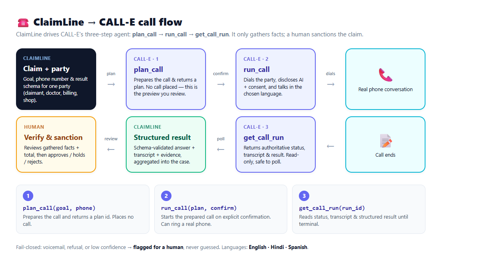

# ClaimLine

**A multi-customer insurance claims platform that works the phones with [CALL-E](https://github.com/CALLE-AI/call-e-integrations).**

ClaimLine is a runnable TypeScript app for an insurance company: it holds **customers and
policies**, lets a claim be **submitted for a policyholder**, then calls every party involved
to gather the facts — in **English, Hindi, or Spanish** — and aggregates an evidence-backed
case a human can **sanction**.



A claim is a **case** with several associated parties, and ClaimLine calls each one to gather
its piece:

1. **Claim intake** — call the claimant, take a *first notice of loss*, and return a
   schema-validated claim packet (incident type, date, injuries, damage, police report,
   preferred callback window) plus a transcript and evidence.
2. **Medical report** — call the treating doctor / clinic for the injuries, treatment,
   whether they're consistent with the accident, and recovery outlook.
3. **Bill verification** — call the hospital billing desk for the total amount and service
   dates. Amounts roll up into a **case total** for the claim.
4. **Status chasing** — call the repair shop / provider for `work_status`, `eta_date`,
   `estimated_cost`, and blockers, navigating phone menus as needed.

ClaimLine aggregates everything into one case view with a computed total, then a human
**verifies and sanctions** the claim (approve with an amount, reject, or hold). ClaimLine
**only gathers information** — it never approves, denies, prices, or promises a claim on a
call, and every ambiguous outcome is routed to a person.

> **Safe by default: no real calls unless a key is present.** With no `CALLE_API_KEY`
> the app runs in **fixture mode** (everything simulated). Provide a key (on a hosted
> instance or in `.env`) and it switches to **live**, where each real call still needs
> explicit per-call confirmation. Set `CLAIMLINE_MODE` to force either mode.

---

## The problem it solves

- Policyholders wait on hold and repeat themselves; claim updates are slow.
- Adjusters burn hours on repetitive fact-gathering calls across multiple parties.
- ClaimLine does the boring phone work quickly and consistently, aggregates every party's
  account plus the total bill, and hands a human an evidence-backed case to sanction —
  routing anything uncertain to a person instead of guessing.

### A short user journey (bike accident)

Alex has a bike accident. Priya, a claims handler, opens the claim in ClaimLine — a case with
three parties: **Alex** (claimant), **Dr. Rao** (treating doctor), and **City General billing**.
She reviews each script (numbers stay masked, e.g. `+*******0164`) and places the calls.
CALL-E dials each party, discloses it's an AI assistant and that the call is recorded, gets
consent, and returns structured, evidence-backed results: the injuries and that they're
*consistent with a bike accident*, and a **$2,450** hospital bill. ClaimLine rolls the bills
into a case total. If the doctor's line goes to voicemail, that call is flagged **Needs
review** rather than guessed. Priya reviews the gathered facts and **sanctions $2,450** — a
human decision ClaimLine never makes on its own.

---

## How CALL-E is used

ClaimLine is the caller; CALL-E places the call and returns a structured result:

```
Claimant / Provider  ◀── phone ──  CALL-E  ◀── SDK / webhook ──▶  ClaimLine
                                                                   ├─ Fastify API + dashboard + webhook
                                                                   ├─ CalleGateway (Live SDK | Fixture)
                                                                   ├─ SQLite store (node:sqlite)
                                                                   ├─ Dispatcher: reserve → preflight → confirm → submit
                                                                   ├─ Reconciler: verify → classify → transition
                                                                   └─ Human review + decision (never auto-applied)
```

Integration is the **`@call-e/calle`** server SDK, wrapped behind a small `CalleGateway`
interface with two implementations:

- **`LiveCalleGateway`** — real calls via `client.calls.create(...)` / `client.calls.get(...)`
  with a stable idempotency key.
- **`FixtureCalleGateway`** — deterministic canned outcomes loaded from `fixtures/`, so the
  whole workflow runs with no credentials and no dialing.

ClaimLine also ships an **MCP server** so an AI agent host can drive the same workflow as tools
(see [MCP server](#mcp-server)).

---

## Safety model

- **No-call default.** With no API key the app is in fixture mode and places no real calls.
  Live mode additionally requires a per-call `confirm`; a preview alone never dials.
- **Consent + disclosure.** Every generated script opens by stating it is an AI assistant,
  that the call is recorded, and asks for consent; a decline ends the call.
- **Masked numbers.** Full E.164 numbers live only in an access-controlled claim record.
  Previews, logs, and the dashboard show only the last four digits (`+*******0142`). Numbers
  are validated strictly and never silently "repaired".
- **Stable idempotency.** The idempotency key is derived from the authorized intent
  (claim + call type + destination + schema version), not from an attempt, so a retry never
  dials a person twice.
- **Application-owned state machine**, kept separate from CALL-E's call status:
  `reserved → submission_unknown → accepted → terminal_unverified → terminal_verified →
  needs_human → applied` (+ `canceled`).
- **Fail-closed dispositions.** A result is only `auto_ok` when the call completed, the task
  is complete, confidence clears the threshold, the structured result validates, and no
  voicemail/refusal is detected. Everything else becomes `needs_human`.
- **Webhook as a wake-signal only.** The `/calle/webhook` receiver stores a deduplicated
  event and the reconciler then fetches the **authoritative** call state before acting — the
  webhook body is never trusted as the source of truth.
- **Cancellation.** A `reserved` intent can be canceled before it is dialed.
- **Human owns decisions.** ClaimLine only reaches a decision from `terminal_verified` or
  `needs_human`; a person records the outcome. Nothing is auto-applied.

---

## Requirements

- **Node.js ≥ 22.5** (uses the built-in `node:sqlite` — no native build step).
- npm (a `package-lock.json` is included). No unpublished/private package dependencies.

## Install

```bash
cd apps/typescript/claimline
npm install
```

## Quick start (no calls placed)

Run the full end-to-end demo entirely in fixture mode:

```bash
npm run cli demo
```

This seeds two demo claims, previews and "places" an FNOL call and a status-chase call,
demonstrates a voicemail correctly routed to `needs_human`, reconciles, and records a human
decision — without dialing anyone.

### The app (multi-page)

```bash
npm run dev            # or: npm run build && npm start
# open http://localhost:8787
```

ClaimLine is a multi-page web app with a top navigation:

| Page | What it does |
| --- | --- |
| **Dashboard** (`/`) | KPIs (customers, claims, open, needs-review, sanctioned, calls) + recent claims. |
| **Customers** (`/customers`) | All policyholders with their language, policies, and claims. **＋ New customer** onboards a policyholder (+ optional first policy); open one for detail. |
| **Claims** (`/claims`) | Every claim with policyholder, incident, language, billed total, and status. |
| **Claim detail** (`/claims/:id`) | The case: each party, its call + structured result, the case total, and the **sanction** panel. |
| **New claim** (`/submit`) | Submit a claim for a customer: pick policyholder, language, incident, and parties to call. |
| **How it works** (`/how`) | The CALL-E `plan_call → run_call → get_call_run` flow diagram. |
| **Log in** (`/login`) | Owner login (uses the server's key) or continue as a guest (bring your own key). |

Click **Seed demo data** (Dashboard) to load 5 customers with policies and 3 claims (including
a multi-party bike-accident case and Spanish/Hindi customers). From a claim, each party has a
**📞 Call** button that opens a **Review before calling** page (masked number, the exact
script, what it collects, and — in demo mode — a simulated outcome). Press **Place call**
(fixture mode simulates it). Completed calls render as readable tables; unclear calls are
flagged **Needs review**. A call that **failed or went to voicemail shows a ↻ Retry call**
button that places a fresh attempt (a new call, so idempotency never blocks a genuine retry).
When you've gathered enough, **Approve / Hold / Reject** the claim.

### Languages

Each claim (and optionally each party) is called in **English**, **Hindi**, or **Spanish**.
The choice maps to a supported CALL-E region + locale (`en-US`, `hi-IN`, `es-MX`) and adds an
explicit "conduct the call in <language>" instruction to the script.

### Accounts & login

Browsing is open (you land as an implicit guest). Placing a **live** call needs a CALL-E key,
and ClaimLine supports two roles so a shared/hosted instance can protect its own credits:

- **Owner** — logs in with a username + password and places calls using the **server's**
  `CALLE_API_KEY`. Owner login is **disabled unless `CLAIMLINE_OWNER_PASS` is set**, so the
  public source never carries a working owner account. The owner session is a signed,
  stateless cookie, so **it survives a server restart / redeploy** (the owner carries no
  secret — they use the server key).
- **Guest** — continues without a password and, in live mode, pastes **their own** CALL-E API
  key. The guest key is held **in the session only** — never written to the database, logs, or
  any page — and is used solely for that guest's calls.

In fixture mode no key is needed at all (calls are simulated). Background reconciliation uses
the server key, so it only advances owner/fixture calls; a guest's calls reconcile on demand
when the guest views the claim.

### Autopilot, payout & notifications

- **🚀 Autopilot.** On a claim, **Run autopilot** places a call to *every* party at once
  (claimant, doctor, billing, repair shop…), reconciles them, and produces a consolidated
  **end-of-case report**. When all calls finish, the report is delivered automatically (and can
  be re-sent from the claim page).
- **📤 Slack / Teams.** The report is posted to **Slack** and/or **Microsoft Teams** via an
  incoming webhook (`SLACK_WEBHOOK_URL` / `TEAMS_WEBHOOK_URL`). With neither set, a **simulated
  notifier** records it so autopilot always works with no integration configured.
- **💳 Stripe payout (demo).** Once a claim is **approved** with an amount, **Pay out** disburses
  it. With `STRIPE_SECRET_KEY` (test mode) it creates a real Stripe PaymentIntent; without a key
  it records a **simulated success** — no real money moves. Payouts are idempotent per claim.

All three are **demo-safe by default** (no external keys required) and are driven from the
claim page.

---

## CLI reference

```
npm run cli <command> [flags]

seed                                    Create demo claims (CLM-1001, CLM-1002)
claims                                  List all claims and their calls
show     --claim CLM-1001               Show one claim with results/transcript
preview  --claim CLM-1001 --type fnol   Print a masked call preview (no call)
call     --claim CLM-1001 --type fnol [--confirm] [--scenario name]
                                        Dispatch a call (preview unless --confirm)
reconcile                               Poll in-flight calls; verify + classify
cancel   --intent <id>                  Cancel a reserved intent before dialing
decide   --intent <id> --decision "..." [--by name] [--note "..."]
demo                                    Run the full no-call end-to-end demo
```

`--type` is `fnol` (default) or `status`.
Fixture `--scenario`: `fnol_ok`, `status_ok`, `voicemail`, `refusal`, `low_confidence`, `failed`.

Example:

```bash
npm run cli seed
npm run cli call --claim CLM-1001 --type fnol            # preview only, no call
npm run cli call --claim CLM-1001 --type fnol --confirm  # place (simulated) call
npm run cli reconcile
npm run cli show --claim CLM-1001
```

---

## HTTP API

| Method | Path | Purpose |
| --- | --- | --- |
| `GET`  | `/api/health` | Health + current mode. |
| `POST` | `/api/seed` | Create the demo claims. |
| `GET`  | `/api/claims` | List claims with intents, results, decisions. |
| `POST` | `/api/claims` | Create a claim (`reference`, `policyholderName`, `claimantPhone`, …). |
| `GET`  | `/api/claims/:id` | One claim view. |
| `POST` | `/api/claims/:id/dispatch` | `{ callType, confirm, fixtureScenario? }`. |
| `POST` | `/api/intents/:id/cancel` | Cancel a reserved intent. |
| `POST` | `/api/intents/:id/decision` | Record a human decision. |
| `POST` | `/api/reconcile` | Run one reconciliation pass. |
| `POST` | `/calle/webhook` | CALL-E terminal webhook (wake-signal, deduped). |

All JSON responses mask phone numbers; full E.164 numbers stay in the store.

---

## MCP server

An agent host (Claude Code, Cursor, Codex, or any MCP client) can drive ClaimLine over MCP.
The server runs on stdio and exposes these tools:

| Tool | Purpose |
| --- | --- |
| `list_claims` | List claims with calls/results (masked numbers). |
| `get_claim` | One claim by id or reference (e.g. `CLM-1001`). |
| `get_case` | Aggregated case: all parties, results, total billed, sanction. |
| `create_claim` | Create a claim (E.164 numbers, returned masked). |
| `add_contact` | Add a party (doctor, billing, repair shop, witness…). |
| `preview_call` | Masked spoken goal + result schema; places no call. |
| `dispatch_call` | Claim-level call: reserve/preview, or place when `confirm: true`. |
| `call_contact` | Call a specific party (role-appropriate); `confirm: true` to place. |
| `reconcile` | Fetch authoritative state, verify, classify, transition. |
| `cancel_intent` | Cancel a reserved intent before dialing. |
| `apply_decision` | Record a per-call reviewer note (marks it reviewed). |
| `sanction_claim` | Record the human claim outcome (approve/reject/hold + amount). |

Run it:

```bash
npm run mcp            # dev (tsx)
# or, after building:
npm run build && node dist/mcp.js
```

Example MCP client config:

```json
{
  "mcpServers": {
    "claimline": {
      "command": "node",
      "args": ["dist/mcp.js"],
      "cwd": "apps/typescript/claimline",
      "env": { "CLAIMLINE_MODE": "fixture" }
    }
  }
}
```

The same safety rules apply: `dispatch_call` places a call only with `confirm: true`, fixture
mode never dials, and every returned phone number is masked.

---

## Result schemas

**FNOL intake** (`fnol.v1`): `incident_type` (enum), `incident_datetime`, `incident_location`,
`description`, `injuries` (yes/no/unknown), `damaged_items[]`, `other_party_involved`,
`police_report_filed`, `preferred_callback_window`, `consent_recorded`.

**Status chase** (`status_chase.v1`): `work_status` (not_started/in_progress/completed/unknown),
`eta_date`, `estimated_cost_amount`, `estimated_cost_currency`, `blockers`, `contact_name`.

**Medical report** (`medical_report.v1`): `injuries_summary`, `treatment_provided`,
`accident_consistent` (yes/no/unknown), `treatment_ongoing` (yes/no/unknown),
`expected_recovery`, `contact_name`.

**Bill verification** (`bill_verification.v1`): `total_amount`, `currency`,
`service_from_date`, `service_to_date`, `itemized_available`, `contact_name`. Verified totals
across a case are summed into the claim's aggregate.

A compact schema is sent to CALL-E as the `resultSchema`; a stricter schema (formats, bounds)
validates the reply locally after the call.

---

## Going live (opt-in)

Live calls turn on as soon as a `CALLE_API_KEY` is present (set `CLAIMLINE_MODE` to force a
mode). To place real calls:

1. Get an API key from the [CALL-E dashboard](https://dashboard.heycall-e.com/account/api-keys).
2. Copy `.env.example` to `.env` and set:
   ```bash
   CALLE_API_KEY=your_key_here          # presence of a key switches to live
   CLAIMLINE_MODE=live                  # optional; explicit override
   CLAIMLINE_OWNER_PASS=your_password   # enables owner login (uses this key)
   CLAIMLINE_SESSION_SECRET=long-random-string
   # optional: receive terminal results by webhook instead of only polling
   CLAIMLINE_PUBLIC_BASE_URL=https://your-host.example
   CLAIMLINE_WEBHOOK_SECRET=some-shared-secret
   ```
3. Start the app, **log in as owner** (or as a guest with your own key), and place a call
   **with confirmation** (`--confirm`, or the dashboard button). Only numbers you are
   authorized to call should be used. Use a phone number you control for your first live test.

Credentials are read from the environment only, are never written to the database, and never
appear in previews, logs, or the dashboard.

---

## Deploy (Docker / Render)

ClaimLine ships a `Dockerfile`, a `docker-compose.yml`, and a Render `render.yaml` blueprint.
SQLite is embedded (`node:sqlite`), so there is **no external database to provision**.

**One-click (after pushing this repo to GitHub):** replace the repo URL, then click —

[](https://render.com/deploy?repo=https://github.com/YOUR_USERNAME/YOUR_REPO)

Render reads `render.yaml`, provisions the service, and prompts for the secret env vars
(`CALLE_API_KEY`, `CLAIMLINE_OWNER_PASS`) while generating `CLAIMLINE_SESSION_SECRET` for you.

**Run the container anywhere:**

```bash
docker compose up --build      # http://localhost:8787
```

**Render (free):** New → Web Service → **Docker**, pointed at this folder's `Dockerfile`
(or set *Root Directory* to `apps/typescript/claimline` and let `render.yaml` drive it), then
set these environment variables in the dashboard (secrets stay off git):

| Variable | Value |
| --- | --- |
| `CALLE_API_KEY` | your CALL-E key (secret) |
| `CLAIMLINE_MODE` | `live` |
| `CLAIMLINE_OWNER_USER` | `garglakshay` |
| `CLAIMLINE_OWNER_PASS` | your owner password (secret) |
| `CLAIMLINE_SESSION_SECRET` | a long random string |
| `CLAIMLINE_INSURER_NAME` | `ClaimLine Insurance` |

The health check path is `/api/health`. On the free plan the disk is **ephemeral**, so
ClaimLine **auto-seeds demo customers and claims on an empty boot** (disable with
`CLAIMLINE_AUTOSEED=false`); for durable storage attach a paid disk or use a host with a free
volume (e.g. Fly.io) and point `CLAIMLINE_DB` at it.

---

## Configuration

| Variable | Default | Meaning |
| --- | --- | --- |
| `CLAIMLINE_MODE` | auto | `fixture` (no calls) or `live`. Auto-selects `live` when `CALLE_API_KEY` is set, else `fixture`. |
| `CALLE_API_KEY` | — | CALL-E key. Its presence switches the app to live mode. |
| `CALLE_BASE_URL` | SDK default | Optional CALL-E API base override. |
| `PORT` | `8787` | Dashboard + webhook port. |
| `CLAIMLINE_DB` | `./data/claimline.db` | SQLite file path (`:memory:` supported). |
| `CLAIMLINE_CONFIDENCE_THRESHOLD` | `0.6` | Minimum confidence for `auto_ok`. |
| `CLAIMLINE_INSURER_NAME` | `ClaimLine Insurance` | Company name used in the UI + call disclosure. |
| `CLAIMLINE_OWNER_USER` | `garglakshay` | Owner login username. |
| `CLAIMLINE_OWNER_PASS` | — | Owner password. **Unset disables owner login** (keeps the public source credential-free). |
| `CLAIMLINE_SESSION_SECRET` | dev placeholder | Secret used to sign session cookies. Set a long random value in production. |
| `CLAIMLINE_AUTOSEED` | `true` | Seed demo data on an empty boot. Set `false` to start empty. |
| `STRIPE_SECRET_KEY` | — | Stripe **test** key for demo payouts. Unset → simulated success. |
| `SLACK_WEBHOOK_URL` | — | Slack incoming webhook for autopilot reports. |
| `TEAMS_WEBHOOK_URL` | — | Microsoft Teams incoming webhook for autopilot reports. |
| `CLAIMLINE_PUBLIC_BASE_URL` | — | Public base URL for the CALL-E webhook (live). |
| `CLAIMLINE_WEBHOOK_SECRET` | — | Shared secret to authenticate webhooks. |

---

## Tests

```bash
npm test         # Vitest: unit + e2e + HTTP/pages + auth + MCP + case flow + language + live-gateway
npm run typecheck
```

Tests use the fixture gateway and an in-memory database, so they need no credentials and place
no calls.

## Project layout

```
claimline/
├── src/
│   ├── domain/     # types, state machine, phone (E.164 + masking), idempotency, disposition, language
│   ├── schemas/    # intake + status + medical + bill result schemas (Ajv)
│   ├── calle/      # CalleGateway interface, Live SDK + Fixture + Null implementations
│   ├── payments/   # PaymentGateway: Stripe (test mode) + simulated payout
│   ├── notify/     # Slack / Teams webhook notifier + simulated fallback
│   ├── store/      # node:sqlite store (customers, policies, claims, contacts, intents, results, decisions, payments)
│   ├── services/   # tasks (scripts + language), dispatcher, reconciler, report (autopilot end report)
│   ├── server/     # Fastify app + multi-page HTML views + auth (owner/guest sessions)
│   ├── mcp/        # MCP server + tools (agent-host integration)
│   ├── app.ts      # application context wiring
│   ├── cli.ts      # command-line interface
│   ├── mcp.ts      # MCP stdio entry
│   └── index.ts    # server entry
├── assets/         # CALL-E flow diagram (diagram.html → calle-flow.png)
├── fixtures/       # inspectable canned call outcomes (no real calls)
├── Dockerfile      # container image (node:22 + node:sqlite)
├── docker-compose.yml
├── render.yaml     # Render.com deploy blueprint
└── test/           # Vitest suites
```

## Limitations

- Fixture outcomes are illustrative; they do not predict real call behavior.
- Live behavior across regions, IVRs, and languages has not been exhaustively tested — treat
  the first live calls as a supervised trial.
- Sample phone numbers use the reserved fictional `555-01xx` range.
